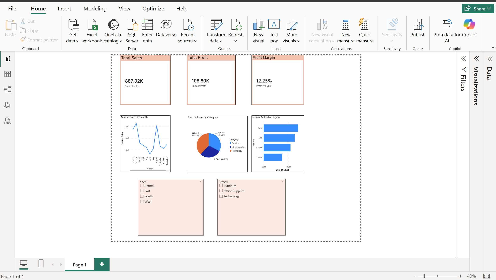

# 📊 Power BI Sales Dashboard

## 📌 Project Overview
This project showcases a Power BI dashboard created to analyze sales performance using real-world data.

## 🔧 Tools Used
- Power BI
- Excel / CSV Dataset

## 📈 Key Features
- KPI Cards (Total Sales, Profit, Profit Margin)
- Sales by Region (Bar Chart)
- Monthly Sales Trend (Line Chart)
- Category-wise Sales (Pie Chart)
- Interactive Filters (Slicers)

## 📷 Dashboard Preview

## 🚀 Insights
- Identified top-performing regions
- Analyzed sales trends over time
- Compared category-wise performance
